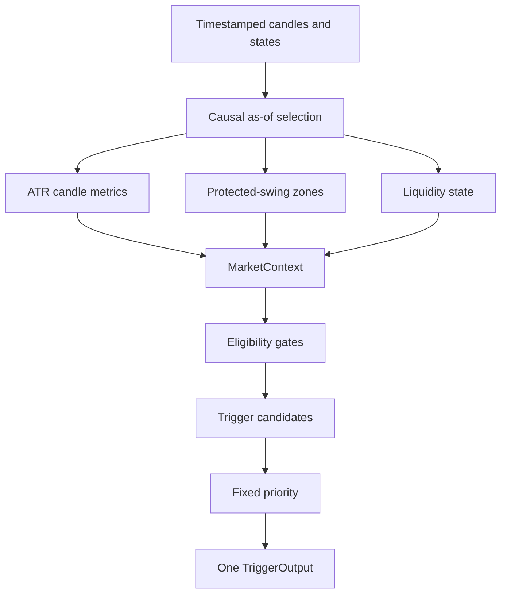

# Contextual Price Action Policy

## Purpose

The contextual price-action package converts point-in-time market state into
at most one canonical candle trigger. It is an isolated decision-support
component. It does not create setups, calculate indicators, size positions,
place orders, or change the current production signal pipeline.

## Causal contract

Every evaluation requires an explicit `decision_time`.

Candles require an explicit `close_time` column, or a `DatetimeIndex` named
`close_time`. A candle is visible only when:

```text
close_time <= decision_time
```

The selector normalizes times to UTC, filters before accessing the latest
candle, and uses a stable chronological sort. Naive timestamps are interpreted
as UTC.

HTF regime, structure state, and protected swings carry their own
`confirmed_at` timestamps. Protected swings also carry `formed_at`. The
context engine rejects:

- HTF state confirmed after `decision_time`
- structure confirmed after `decision_time`
- swings confirmed after `decision_time`
- swings confirmed before they formed
- missing explicit candle close times

It never silently substitutes a future state.

## Architecture



## Context contents

`MarketContext` is immutable and contains:

- decision time
- timestamped HTF regime
- timestamped structure trend
- confirmed protected swing high and low
- current and previous closed candle
- ATR-normalized current-candle metrics
- premium, discount, and pullback zones
- protected-swing liquidity state
- number of closed candles visible at the decision

## ATR-normalized candle metrics

For current candle body \(B\), range \(R\), and point-in-time ATR \(A\):

```text
body_atr = B / A
range_atr = R / A
upper_wick_ratio = upper_wick / R
lower_wick_ratio = lower_wick / R
close_location = (close - low) / R
```

`close_location` is zero at the candle low and one at the candle high. A
zero-range candle receives zero wick ratios and a neutral close location of
0.5. ATR must be finite and greater than zero.

These measurements are invariant when OHLC and ATR are multiplied by the same
positive scale.

## Zones

Zones require a confirmed protected swing high above a confirmed protected
swing low.

The midpoint is equilibrium:

```text
equilibrium = low + 0.500 * range
```

Pullback zones are:

```text
BUY  = low + 0.382 * range through equilibrium
SELL = equilibrium through low + 0.618 * range
```

Other prices are classified as `DISCOUNT`, `PREMIUM`, or `EQUILIBRIUM`.
Without both protected swings, location is `UNAVAILABLE`.

## Liquidity events

A swing-high sweep occurs when a closed candle trades above the protected
high. A swing-low sweep occurs when a closed candle trades below the protected
low.

Rejection is confirmed when:

- the sweep candle closes back inside the protected level; or
- the next closed candle closes back inside the level in the rejecting
  direction.

Supported events:

- `SWING_HIGH_SWEEP`
- `SWING_LOW_SWEEP`
- `SWING_HIGH_SWEEP_REJECTION`
- `SWING_LOW_SWEEP_REJECTION`
- `DUAL_SWEEP`
- `DUAL_SWEEP_REJECTION`
- `NONE`

No candle after `decision_time` participates.

## Trigger eligibility

The trigger engine fails closed unless all conditions pass:

1. an existing BUY or SELL setup is supplied
2. the setup is active and not expired
3. HTF regime agrees with setup direction
4. structure trend agrees with setup direction
5. price is inside the direction-specific pullback zone

A candle pattern alone cannot pass these gates.

## Trigger candidates

The engine evaluates:

- `DISPLACEMENT`
  - body/ATR at least 0.8
  - range/ATR at least 1.0
  - directional close location at or beyond 0.75/0.25
- `ENGULFING`
  - the current body directionally engulfs the previous closed body
- `REJECTION`
  - directional wick ratio at least 0.5
  - directional close location at or beyond 0.65/0.35
- `LIQUIDITY_REJECTION`
  - a directionally relevant protected-swing sweep rejection exists

These rules are fixed policy values for this isolated component. They do not
modify any existing strategy or indicator threshold.

## Canonical priority

If multiple candidates exist on one candle, exactly one is emitted:

1. `LIQUIDITY_REJECTION`
2. `ENGULFING`
3. `REJECTION`
4. `DISPLACEMENT`

If none exists, the canonical result is `NONE`.

## Output

`TriggerOutput.to_dict()` returns:

```text
trigger
direction
location
liquidity_event
candle_quality
valid_until
reason_codes
```

`valid_until` is an ISO-8601 UTC timestamp. `reason_codes` records the failed
gate or all passed gates plus the selected canonical trigger.

## Integration policy

Phase 6 does not connect this engine to `SignalEngine` or `SignalPipeline`.
That preserves current trading decisions and backtests. Any later production
integration requires a separate approved phase with before/after decision and
backtest validation.

## Limitations

- HTF and structure generation remain upstream responsibilities.
- The engine validates state timestamps but does not resample timeframes.
- OHLC data cannot reveal intrabar event order.
- Protected-swing quality depends on the upstream structure implementation.
- Pullback ratios and trigger measurements are policy definitions, not
  statistically optimized values.
