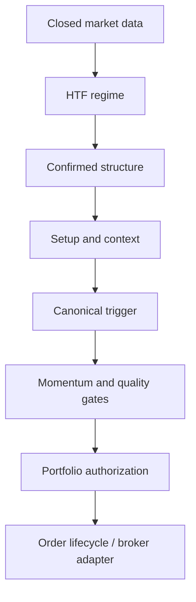

# Phase 3–8 Validation Report

## Executive summary

Phases 3–8 establish causal signal-quality gates, event-driven market
structure, contextual price action, portfolio protection, deterministic broker
simulation, AI-ready point-in-time data contracts, reproducible research
manifests, and broker/account production boundaries.

The Phase 1 next-bar execution and cash-accounting engine remains intact. The
Phase 2 closed-candle and versioned historical-data contracts remain the common
timestamp foundation.



## Phase 3 — Advanced signal engine

- Added a causal market classifier with orthogonal trend and volatility states.
- Corrected HTF responsibility to directional regime only.
- Added strict production/research MTF constructors and explicit hierarchy
  validation.
- Added hard vetoes for HTF, structure, CHoCH, momentum, and contextual
  disagreement.
- Prevented conflicting evidence from earning quality points.
- Corrected SELL participation ranking to require falling OBV; Yahoo FX volume
  remains excluded.
- Preserved the public `SignalEngine.generate_signal` signature and legacy
  dictionary keys.

## Phase 4 — Market structure intelligence

- Replaced separated high/low heuristics with an ordered confirmed swing-event
  stream.
- Every swing records `formed_at` and `confirmed_at`.
- Added immutable structure state, protected swings, HH/HL/LH/LL labels,
  close-confirmed BOS, trend-changing CHoCH, event de-duplication, false
  breakout classification, and structure quality.
- Existing `MarketStructure` wrapper methods remain available.

## Phase 5 — Contextual price action

- Integrated ATR-normalized candle metrics, protected-swing zones, liquidity
  sweeps, and canonical contextual triggers into the signal pipeline.
- Added rejection, displacement/breakout, engulfing, morning/evening star, and
  inside-bar breakout recognition under setup/HTF/structure/location gates.
- Fixed setup expiry so a continuously valid setup can be re-formed after its
  prior window expires.
- Standardized context preparation on the shared candle-close contract.

## Phase 6 — Risk protection and execution

- Added post-signal `ALLOW`, `BLOCK`, and optional `REDUCE_SIZE` decisions.
- Added causal daily/weekly loss, drawdown, consecutive-loss, open-trade,
  portfolio-heat, correlation, session, volatility, and news controls.
- All portfolio limits are disabled by default.
- Added immutable order/fill/event models and a deterministic broker simulator
  with spread, slippage, commission, latency, rejection, partial fills,
  timeouts, idempotency, market/limit orders, and UTC lifecycle validation.
- Main paper flow now uses current equity, configured instrument economics,
  correct 1-day/1-hour timeframe roles, and portfolio authorization while
  preserving the paper-trading method signatures.

## Phase 7 — AI-ready quality layer

- Added versioned immutable point-in-time feature snapshots.
- Added future/outcome leakage guards and explicit source-availability audit
  timestamps.
- Added append-only decision/outcome event storage with deterministic CSV and
  JSONL exports.
- Added a direction-free quality filter interface that is disabled by default.
- No model was trained and no AI layer can create BUY or SELL.

## Phase 8 — Production foundation

- Added broker-neutral order, fill, position, account, health, and adapter
  contracts.
- Added fail-closed MT5 and exchange adapter stubs; no live connectivity is
  enabled.
- Added deterministic order reconciliation.
- Added isolated multi-account lifecycle/configuration storage.
- Added persistent fail-closed emergency stop and maximum exposure guard.
- Added validated non-secret environment configuration and rotating structured
  JSON event logs.

## Reproducibility and performance

- Experiment identity now includes the full dataset digest, source revision,
  random seed, instrument assumptions, and execution settings.
- Historical and experiment artifacts use atomic writes.
- Added a bounded causal prefix cache with defensive copies and strict as-of
  selection.
- A local 20,000-row synthetic microbenchmark measured approximately 446x
  improvement for repeated cached as-of selection. This number is
  environment- and workload-dependent and is not a strategy-performance claim.

## Validation results

Commands:

```bash
PYTHONDONTWRITEBYTECODE=1 PYTHONWARNINGS=error pytest tests -v
PYTHONPYCACHEPREFIX=/tmp/forex-bot-compileall python -m compileall .
git diff --check
```

Results:

- Full pytest suite: **267 passed, 2 subtests passed**
- Warnings treated as errors: **passed**
- Full repository compilation: **passed**
- Preflight validation: **passed**
- Whitespace/error check: **passed**
- Deterministic offline backtest: **passed**

Offline backtest validation used generated OHLC candles, the unchanged Phase 1
engine, and the explicit ETH-USD instrument specification:

- completed trades: 2
- winning trades: 2
- net profit: 21.8550
- profit factor: infinite (no losing completed trades)
- expectancy: 10.9275 cash units per completed trade
- average R: 1.0870
- maximum drawdown: 0.0000
- ending equity: 1,021.8550
- open trades: 1

This synthetic run validates accounting and lifecycle behavior; it is not
evidence of strategy profitability.

The documented Yahoo-backed command was also attempted:

```bash
python -m backtesting.run_backtest
```

It could not acquire ETH-USD data because Yahoo returned
`YFRateLimitError`, and no local ETH-USD cache existed. The engine itself is
covered by deterministic offline tests and replay validation.

## Causality guarantees

- Indicators/regime classification are recomputed only after causal candle
  selection.
- HTF candles require `close_time <= decision_time`.
- Unconfirmed swings cannot enter structure state.
- Contextual state and protected levels must be confirmed by decision time.
- Risk state, outcomes, correlations, and equity points are filtered as of the
  request time.
- Orders record explicit creation, eligibility, and fill timestamps.
- AI feature snapshots reject future and outcome fields.

## Known limitations

- Live MT5/exchange adapters intentionally fail closed and require audited
  broker-specific implementations.
- Broker margin, financing, swap, funding, exchange percentage fees, and
  account-specific symbol metadata remain venue-specific work.
- The paper trader retains its legacy scalar-price exit checking; the new
  broker simulator is available without changing that public API.
- Default instrument costs are documented research assumptions, not live
  quotes.
- Portfolio controls need deployment wiring to durable account/trade ledgers
  before enabling non-default limits.
- Market-regime and quality thresholds have not been statistically optimized or
  calibrated; out-of-sample research is still required.
- No live news provider, secrets manager, durable event bus, monitoring stack,
  or trained ML model is included.

## Scope confirmation

- No future data or hardcoded backtest improvement was introduced.
- Phase 1 execution behavior and `BacktestEngine(data, strategy)`
  compatibility remain covered.
- Existing paper-trading public methods remain unchanged.
- No live order can be placed by the added broker adapters.
