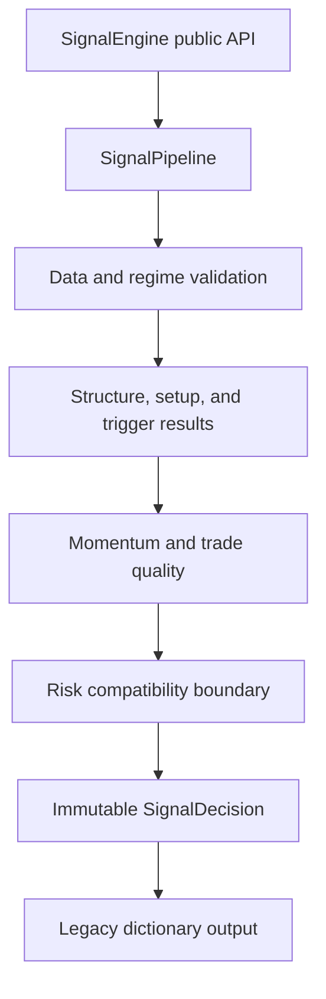

# Phase 5 Strategy Architecture Refactor — Validation Report

## Executive summary

The monolithic `SignalEngine.generate_signal` procedure was separated into an
explicit deterministic pipeline. The public `SignalEngine` constructor,
`generate_signal(data, symbol, higher_tf=None)` signature, returned dictionary
shape, scores, thresholds, reason strings, reason order, confidence, and final
BUY/SELL/HOLD decisions remain compatible with the pre-refactor engine.

No indicator, market-structure, trade-quality, risk, backtest, execution, or
paper-trading implementation was changed.

## Architecture



The pipeline executes these named stages:

| Order | Stage | Owner | Preserved behavior |
|---:|---|---|---|
| 1 | Data validation | `strategy.validators` | Selects `data.iloc[-1]` exactly as before |
| 2 | Market regime | `strategy.validators`, `SignalPipeline` | Existing ADX gate and MTF confirmation |
| 3 | Market structure | `SignalPipeline` | Calls the unchanged `MarketStructure` methods and applies the same scores |
| 4 | Setup detection | `SetupDetector` | Existing EMA/Supertrend alignment and scores |
| 5 | Trigger detection | `TriggerDetector` | Existing candle patterns, stacking, scores, and reasons |
| 6 | Momentum confirmation | `SignalPipeline` | Existing MACD/RSI/Stochastic RSI and volume rules |
| 7 | Trade quality | Existing `TradeQuality` | Same inputs, quality score, and approval threshold |
| 8 | Risk validation | `strategy.validators` | Explicit pass-through preserving the existing post-signal `RiskManager` boundary |
| 9 | Final decision | `SignalPipeline` | Same score thresholds, confirmation counts, confidence cap, and quality veto |

Intermediate result objects are frozen dataclasses. `SignalDecision.to_dict()`
converts the immutable result back to the exact mutable dictionary expected by
existing callers.

The pipeline assembles reasons in the original observable order rather than
the calculation-stage order. This preserves logs, paper-trading output, and
any callers comparing complete result dictionaries.

## Files added

- `strategy/decision.py`
- `strategy/pipeline.py`
- `strategy/setup_detector.py`
- `strategy/trigger_detector.py`
- `strategy/validators.py`
- `tests/fixtures/strategy_refactor_golden.json`
- `tests/test_strategy_architecture.py`
- `PHASE_5_ARCHITECTURE_REFACTOR_VALIDATION_REPORT.md`

## Files modified

- `strategy/signal_engine.py`
  - Reduced to dependency construction and pipeline orchestration.
  - Preserved the public constructor and `generate_signal` signature.
- `tests/test_module6.py`
  - Replaced import-time Yahoo Finance access with deterministic synthetic
    OHLC input. This is a test-only change and does not alter production code.

## Behavioral equivalence

The pre-refactor `strategy/signal_engine.py` was copied outside the repository
before editing and loaded as an independent reference implementation.

Validation performed:

1. 320 complete result-dictionary comparisons across 80 deterministic market
   seeds, Forex and crypto symbols, and runs with and without HTF data.
2. 394 rolling-window historical decision comparisons.
3. Frozen pre-refactor golden dictionaries for two deterministic real
   indicator/structure scenarios.
4. Explicit BUY and SELL characterization covering all legacy score
   contributions.
5. A non-zero backtest comparison using the matched
   `BUY → HOLD → SELL → HOLD` signal sequence. Both engines produced the same
   four ENTRY/EXIT events.

All comparisons were exact Python equality comparisons, including nested
reason arrays and decision summaries.

## Tests

Deterministic unit coverage includes:

- actual pipeline execution order
- frozen pre-refactor output compatibility
- public `SignalEngine` method signature
- legacy early-HOLD output shape
- immutable decision contracts
- ADX boundary and validator behavior
- bullish, bearish, and neutral setup detection
- complete bullish and bearish trigger scoring
- explicit BUY and SELL final decisions
- offline market-structure and candle smoke coverage

## Validation results

```text
PYTHONDONTWRITEBYTECODE=1 PYTHONWARNINGS=error \
python -m unittest discover -s tests -v

Ran 9 tests
OK
```

- Frozen-engine differential comparisons: 320 passed
- Rolling historical decision comparisons: 394 passed
- Non-zero backtest parity: 4 identical ENTRY/EXIT events
- Active Python compilation: 36 files passed
- `git diff --check`: passed
- Protected production-module diff guard: passed
- `pytest`: not installed; the repository's `unittest` discovery runner was
  used

## Preserved legacy behavior

This phase intentionally does not correct existing strategy issues, including:

- the ADX gate uses `35` while its existing reason says “below 25”
- candle patterns can stack scores
- bearish momentum containing the word `confirmed` appears in the existing
  positive decision-summary list
- SELL volume confirmation retains the existing bullish-OBV condition
- the signal layer has no risk filter; `RiskManager` remains downstream

Changing any of these would violate the architectural-refactor-only scope.

## Scope confirmation

- Trading decisions: unchanged
- Scores and thresholds: unchanged
- Indicators: unchanged
- Market structure: unchanged
- Trade quality: unchanged
- Risk management: unchanged
- Backtesting: unchanged
- Execution and fills: unchanged
- Paper trading: unchanged
- Commit, push, or tag: not performed
