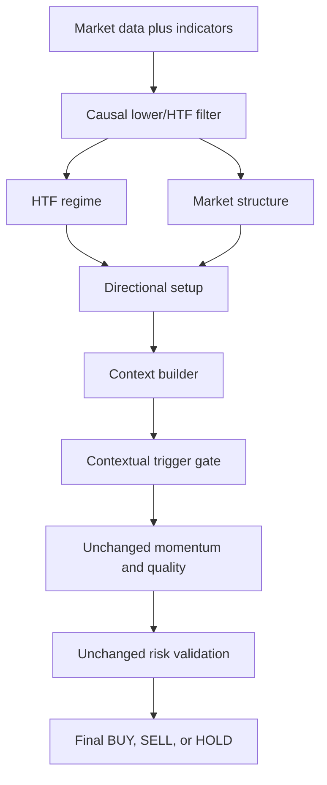

# Phase 6.1 Contextual Price Action Production Integration

## Executive summary

The existing Phase 6 contextual price-action engine is now integrated into
the default production `SignalPipeline` between setup detection and momentum
confirmation.

The Phase 6 engine was not redesigned or edited. A strategy-side adapter
converts existing point-in-time production state into the immutable Phase 6
contracts. The contextual trigger can confirm or reject an already-directed
setup; it cannot originate BUY or SELL direction.

The public `SignalEngine` constructor, method signature, and dictionary output
contract remain unchanged.

## Architecture



Production stage order:

1. data validation
2. market regime
3. market structure
4. setup detection
5. context builder
6. contextual trigger
7. momentum confirmation
8. trade quality
9. risk validation
10. final decision

## Integration boundary

`strategy/contextual_integration.py` is the only Phase 6 translation layer.
It:

- detects explicit `close_time` or a timestamp index
- resolves `decision_time`
- filters lower and higher timeframes independently
- computes the observed lower-timeframe bar duration
- converts the existing latest confirmed swing high and low into
  timestamped `ProtectedSwing` objects
- constructs the immutable Phase 6 `MarketContext`
- evaluates the unchanged `ContextualTriggerEngine`
- returns a confirmation-only gate result to the production pipeline

The adapter does not calculate indicators, alter risk, place orders, or
modify fills.

## Decision-time contract

The caller may provide a historical decision boundary through:

```python
data.attrs["decision_time"] = timestamp
```

Otherwise, the last supplied lower-timeframe timestamp is the decision time.

Lower and higher timeframe data are filtered before production logic:

```text
close_time <= decision_time
```

An explicit `close_time` column is preferred. A `DatetimeIndex` is treated as
the supplied candle-close timestamp for legacy production compatibility.
Inputs without either remain on the exact Phase 5 compatibility path.

## Confirmed HTF and structure state

The HTF analyzer receives only higher-timeframe candles closed by the lower
decision time. Its latest visible close becomes the regime
`confirmed_at`.

Market structure receives only filtered lower-timeframe candles. Its state is
available at the current closed decision candle.

If no confirmed HTF state exists, contextual integration fails closed and a
candidate BUY or SELL is rejected.

## Confirmed protected swings

The adapter uses the existing `MarketStructure.find_swings` implementation
without changing its logic.

For each latest swing:

- `formed_at` is the swing candle close
- `confirmed_at` is the existing right-lookback confirmation candle close
- a swing is omitted if its confirmation exceeds `decision_time`

Only those timestamped swings are passed to `ContextEngine`.

## Setup ownership

`SetupDetector` remains responsible for the existing EMA/Supertrend setup
score and now owns contextual setup lifecycle.

Direction is created only when all three existing states agree:

| Setup | HTF | Structure | Direction |
|---|---|---|---|
| Bullish | BULLISH | BULLISH | BUY |
| Bearish | BEARISH | BEARISH | SELL |
| Any disagreement | Any | Any | None |

Formation and expiry are tracked independently per symbol. The integration
default uses three observed lower-timeframe bar durations. A setup does not
receive a new expiry on every candle. It must lose alignment before a new
same-direction setup can form after expiry.

If historical evaluation moves backward in time, stored state for that symbol
is reset before a new setup is formed.

## Contextual trigger ownership

The unchanged Phase 6 trigger receives `SetupContext` after direction has
already been established.

It may return:

- the same setup direction plus one canonical trigger; or
- `NONE` when setup, regime, structure, location, expiry, or candle context
  fails.

The production pipeline applies this rule:

```text
legacy candidate BUY/SELL
AND contextual trigger confirms the same existing direction
→ retain candidate

otherwise
→ HOLD
```

A contextual trigger never changes HOLD into BUY or SELL and never reverses
direction.

## Unchanged responsibilities

- Existing momentum calculations remain unchanged.
- Existing volume scoring remains unchanged.
- Existing `TradeQuality.evaluate` inputs and behavior remain unchanged.
- Existing risk validation remains unchanged.
- Existing final score and confidence calculations remain unchanged.
- The legacy candle score remains an unchanged quality/scoring input, but
  cannot bypass contextual rejection.

## Backward compatibility

`SignalEngine` remains:

```python
SignalEngine()
SignalEngine.generate_signal(data, symbol, higher_tf=None)
```

Return keys remain:

```text
signal
confidence
score
reasons
decision_summary  # when present under the existing contract
```

Untimestamped legacy callers bypass the new contextual gate. Frozen Phase 5
output dictionaries continue to compare exactly.

## Files added

- `strategy/contextual_integration.py`
- `tests/test_contextual_production_integration.py`
- `PHASE_6_1_CONTEXTUAL_INTEGRATION_VALIDATION_REPORT.md`

## Files modified

- `strategy/decision.py`
  - added timestamped regime and structure fields to immutable internal
    results
- `strategy/setup_detector.py`
  - added direction agreement, formation time, per-symbol lifecycle, and
    expiry tracking
- `strategy/pipeline.py`
  - inserted causal preparation, context construction, contextual trigger,
    and final confirmation-only gate
- `tests/test_strategy_architecture.py`
  - updated the expected production stage order

`strategy/signal_engine.py` was not modified during Phase 6.1.

## Phase 6 engine integrity

All six Phase 6 implementation hashes remained unchanged:

| File | SHA-256 |
|---|---|
| `candle_metrics.py` | `50e77d27d40c0ef8bd67d141afd99c15d7a7bd048ad8a79cccab72cd728509e3` |
| `context.py` | `8b30ae552bc6150547092b6f0cd23cda6429c1434ffc6611483cf6b9c37e391e` |
| `contextual_trigger.py` | `c279d00a66af8ad9f4dc00e3e610a182cd2f36326fd5827bd1c37b62dd58ec64` |
| `liquidity.py` | `8bc436dec938aa26641ddfc669d0bea3b0b1a3949fa12213cdd468e25fb82b50` |
| `trigger_priority.py` | `09db62efd3ce7fb47c6493f7c89f382c91a5de92e710ab026dc6b43cd3df9f68` |
| `zones.py` | `7d535d5ad8e4f0c267e461232341592323449b695803815625fea8ec41c0d7b6` |

## Tests added

Deterministic integration tests prove:

- context receives only historical closed candles
- HTF and structure states are confirmed by decision time
- protected swings are confirmed by decision time
- trigger cannot create direction without a setup
- an existing BUY setup can be rejected
- an existing SELL setup can be rejected
- matching BUY and SELL contexts can confirm existing directions
- future lower-timeframe mutation cannot change a historical decision
- future higher-timeframe mutation cannot change a historical decision
- formation and expiry persist per symbol
- `SignalEngine` constructor and method API remain unchanged
- result dictionary schema remains unchanged

## Validation results

```text
PYTHONDONTWRITEBYTECODE=1 PYTHONWARNINGS=error \
python -m unittest discover -s tests -v

Ran 30 tests
OK
```

- Phase 6.1 integration tests: 9 passed
- Full repository tests: 30 passed
- Active Python compilation: 45 files passed
- `git diff --check`: passed
- Phase 6 hash-integrity guard: passed
- Protected-module diff guard: passed

## Causality confirmation

No Phase 6.1 context path can read a lower or higher timeframe candle whose
close exceeds `decision_time`. Context receives only timestamped state derived
from those filtered candles. Future mutation tests modify OHLC, indicators,
ATR, volume, and HTF prices after the historical decision and prove exact
final-decision equality.

Within the integration contract, no look-ahead path exists.

## Scope confirmation

- Risk management: unchanged
- Execution and fills: unchanged
- Paper trading: unchanged
- Market data: unchanged
- Indicator calculations: unchanged
- Backtesting engine: unchanged
- Portfolio code: unchanged
- Phase 6 engine: unchanged
- Public `SignalEngine` API: unchanged
- Commit, push, or tag: not performed

## Remaining assumptions

- A supplied `DatetimeIndex` represents candle-close time.
- Upstream data must not mislabel an incomplete candle as closed.
- Existing `MarketStructure.find_swings` does not distinguish a richer
  protected-swing concept; Phase 6.1 uses its latest causally confirmed swing
  high and low without changing that logic.
- Setup lifecycle is keyed by symbol because the public `SignalEngine` API
  does not expose timeframe.
