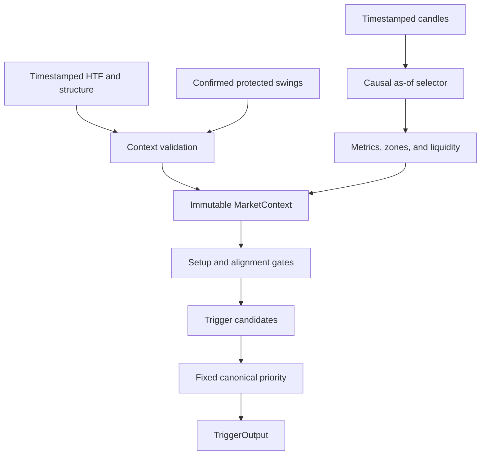

# Phase 6 Contextual Price Action — Validation Report

## Executive summary

Phase 6 adds an isolated, deterministic contextual price-action engine. It
builds immutable point-in-time context from explicitly closed candles and
timestamped upstream state, evaluates contextual eligibility, and emits at
most one canonical trigger.

The component is not connected to the production `SignalEngine` or Phase 5
pipeline. Current trading decisions, risk, execution, backtesting, market
data, indicators, and paper trading therefore remain unchanged.

## Architecture



## Module responsibilities

| Module | Responsibility |
|---|---|
| `price_action/candle_metrics.py` | UTC close-time selection, immutable candle snapshots, ATR-normalized geometry |
| `price_action/zones.py` | Premium, discount, equilibrium, and direction-specific pullback zones |
| `price_action/liquidity.py` | Causal protected-high/low sweeps and same/next-candle rejection |
| `price_action/trigger_priority.py` | Fixed one-trigger priority |
| `price_action/context.py` | Timestamp validation and deterministic `MarketContext` construction |
| `price_action/contextual_trigger.py` | Setup, regime, structure, location, expiry gates and canonical trigger output |

## Context contract

`ContextEngine.build` requires:

- candles with explicit `close_time`
- a `decision_time`
- an HTF `RegimeState` with `confirmed_at`
- a `StructureState` with `confirmed_at`
- optional protected high/low swings with `formed_at` and `confirmed_at`
- point-in-time ATR on the latest visible candle

The resulting immutable context contains:

- HTF regime
- structure trend
- confirmed protected swings
- current and previous closed candles
- body/ATR and range/ATR
- upper/lower wick ratios
- close location
- premium/discount/pullback location
- liquidity sweep and rejection state

## Causality guarantees

1. Candle columns are normalized on a copy.
2. `close_time` is converted to UTC.
3. Candles are filtered with
   `close_time <= decision_time` before any latest/previous-row access.
4. The remaining rows are stably sorted chronologically.
5. HTF and structure states confirmed after the decision are rejected.
6. Protected swings confirmed after the decision are rejected.
7. A swing confirmed before its formation is rejected.
8. ATR is read from the latest visible closed candle.
9. Liquidity detection independently applies the same as-of selector.
10. Trigger evaluation receives only the immutable causal context.

Future-candle mutation tests alter future OHLC and ATR by extreme amounts and
prove exact equality of both historical `MarketContext` and `TriggerOutput`.

## Candle measurements

The engine calculates:

- absolute body divided by ATR
- high-low range divided by ATR
- upper wick divided by range
- lower wick divided by range
- close position within range

The scale-invariance test multiplies all OHLC and ATR values by ten and
confirms identical normalized measurements.

## Liquidity model

Detected states include:

- protected swing-high sweep
- protected swing-low sweep
- close back inside the swept level on the sweep candle
- rejecting close on the next closed candle
- deterministic dual-sweep states

No unclosed or future candle can participate.

## Trigger model

Hard gates require:

1. an existing BUY or SELL setup
2. setup activation and non-expiry
3. matching HTF regime
4. matching structure trend
5. direction-specific pullback location

After all gates pass, the engine evaluates displacement, engulfing,
rejection, and liquidity rejection. Fixed priority is:

1. `LIQUIDITY_REJECTION`
2. `ENGULFING`
3. `REJECTION`
4. `DISPLACEMENT`

The output is always one canonical trigger name, including `NONE`.

## Output schema

```text
trigger
direction
location
liquidity_event
candle_quality
valid_until
reason_codes
```

The frozen result converts to a deterministic JSON-compatible dictionary.

## Files added

- `price_action/candle_metrics.py`
- `price_action/context.py`
- `price_action/contextual_trigger.py`
- `price_action/liquidity.py`
- `price_action/trigger_priority.py`
- `price_action/zones.py`
- `tests/test_contextual_price_action.py`
- `CONTEXTUAL_PRICE_ACTION_POLICY.md`
- `PHASE_6_CONTEXTUAL_PRICE_ACTION_VALIDATION_REPORT.md`

## Files modified

No existing production or test file was modified for Phase 6.

The worktree also contains the previously completed, uncommitted Phase 5
refactor and its deterministic test updates. Phase 6 did not alter those
files.

## Deterministic tests

Phase 6 coverage includes:

- ATR normalization and scale invariance
- swing-high sweep and rejection
- swing-low sweep and rejection
- rejection on the candle after a sweep
- bullish contextual rejection
- bearish contextual rejection
- no-setup blocking
- setup expiry
- future-candle mutation invariance
- future HTF state rejection
- canonical liquidity-rejection priority
- complete trigger-output schema

## Validation results

```text
PYTHONDONTWRITEBYTECODE=1 PYTHONWARNINGS=error \
python -m unittest discover -s tests -v

Ran 21 tests
OK
```

- Phase 6 contextual price-action tests: 12 passed
- Full repository tests: 21 passed
- Future-candle context and trigger equality: passed
- Future-confirmed HTF state rejection: passed
- Active Python compilation: 43 files passed
- `git diff --check`: passed
- Protected-module diff guard: passed

## Scope confirmation

- Risk management: unchanged
- Execution and fills: unchanged
- Paper trading: unchanged
- Backtesting engine: unchanged
- Market data: unchanged
- Indicator calculations: unchanged
- Existing market structure: unchanged
- Existing signal decisions: unchanged
- Commit, push, or tag: not performed

## Remaining limitations

- Upstream HTF, structure, and protected-swing algorithms remain responsible
  for producing correct timestamped states.
- The context engine validates timestamps but does not resample timeframes.
- OHLC cannot reveal intrabar sweep/rejection order.
- The new contextual trigger is intentionally not wired into production.
