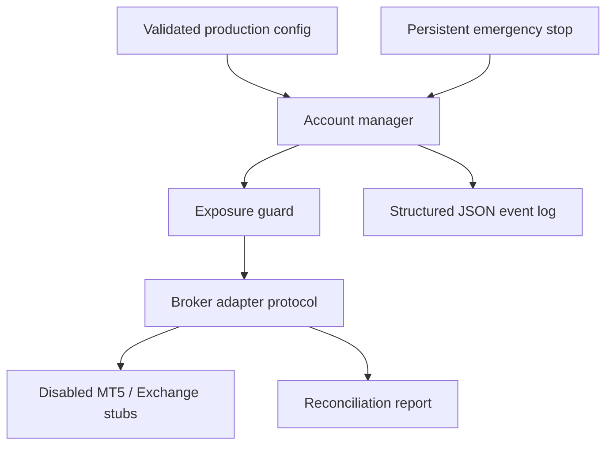

# Production Readiness Foundation

## Scope

This foundation defines safe process boundaries for a future production
deployment without enabling live trading. It does not change signals,
indicators, market structure, sizing, backtesting, paper trading, or the
existing `BotController` API.

Live MT5 and exchange connectivity remains deliberately unavailable. The
provided adapters fail closed on both execution and account reads so a missing
connector cannot be mistaken for an empty or healthy account.

## Architecture



The boundary is intentionally after strategy and portfolio approval. None of
these components can generate a trading direction.

## Contracts

`broker/contracts.py` supplies immutable, UTC-timestamped broker projections:

- `BrokerOrderSnapshot`
- `BrokerFillSnapshot`
- `PositionSnapshot`
- `AccountSnapshot`
- `BrokerHealth`
- the runtime-checkable `BrokerAdapter` protocol

Invalid identifiers, non-finite amounts, negative quantities, overfills, and
naive or non-UTC timestamps are rejected at construction.

`MT5Adapter` and `ExchangeAdapter` are interface placeholders only. Their
health result is unavailable and every account or execution method raises
`ExecutionUnavailableError`. They do not import SDKs, open sockets, read
credentials, or submit orders.

## Multi-account lifecycle

`AccountManager` creates one controller and one storage directory per
validated account ID. Each directory contains only non-secret account
configuration. Account IDs cannot contain path traversal characters.

The manager supports:

- register and deterministic reload;
- start, pause, resume, and stop per account;
- stop all accounts in stable account-ID order;
- maximum configured account count;
- global emergency-stop enforcement before start or resume.

It deliberately does not share mutable controllers, journals, positions, or
configuration files between accounts.

The Telegram-facing `AccountRegistry` adds public MT4/MT5/Exness metadata,
stable compact callback identifiers, account groups, and atomic persistence.
Passwords and bridge tokens are resolved only from per-account environment
variables. `account_supervisor.py` launches isolated paper and MT5-demo worker
processes and rejects duplicate MT5 terminal paths. Registered live accounts
remain read-only and are never launched.

The application-facing default is `AAQTS_SINGLE_ACCOUNT_MODE=true`. Telegram
and `account_supervisor.py` select exactly one registry record, or the explicit
`AAQTS_PRIMARY_ACCOUNT_ID` when a legacy registry contains several. Ambiguous
selection returns no runnable account. Setting the mode to `false` restores the
underlying multi-account behavior without migrating or deleting registry data.

`ControlCommandStore` is a per-account atomic command spool between the
Telegram process and each real worker. Pause, resume, stop, and emergency
requests are therefore not fake Telegram-process controller calls. Every
worker claims only its own queue and records completion or failure.

## Safety controls

`EmergencyStopStore` persists kill-switch state with atomic file replacement.
A missing file means the switch has never been activated. A corrupt or partial
file fails closed and reports `EMERGENCY_STOP_STATE_INVALID`.

`MaxExposureGuard` receives already-calculated current and proposed absolute
gross exposure. It only returns `ALLOW` or `BLOCK`; it never creates a trade,
changes direction, or silently resizes an order.

The worker command spool is wired into `main.py` for pause, resume, stop, and
AAQTS-managed emergency closure. Parent exposure ceilings and per-account risk
profile editing still require a later production composition that enforces the
resolved profile immediately before every broker submission.

## Configuration

`ProductionConfig.from_env()` reads only these non-secret keys:

| Key | Default |
| --- | --- |
| `FOREX_BOT_ENVIRONMENT` | `development` |
| `FOREX_BOT_STATE_DIR` | `state` |
| `FOREX_BOT_LOG_DIR` | `logs` |
| `FOREX_BOT_LOG_LEVEL` | `INFO` |
| `FOREX_BOT_LOG_MAX_BYTES` | `10000000` |
| `FOREX_BOT_LOG_BACKUP_COUNT` | `5` |
| `FOREX_BOT_MAX_ACCOUNTS` | `100` |
| `FOREX_BOT_MAX_GROSS_EXPOSURE` | `1000000` |
| `FOREX_BOT_LIVE_TRADING` | `false` |

Enabling the final setting also requires:

```text
FOREX_BOT_LIVE_ACKNOWLEDGEMENT=I_UNDERSTAND_LIVE_TRADING
```

This acknowledgement only validates configuration. It does not make either
placeholder adapter live. Credentials, tokens, passwords, and private keys
are absent from the configuration model.

## Logging and reconciliation

`StructuredEventLogger` writes size-rotated JSON Lines. Every event contains a
UTC timestamp, correlation ID, account ID, order ID, type, level, message, and
payload. Credential-like payload keys are rejected rather than redacted after
the fact.

`reconcile_orders()` compares explicit internal and broker snapshots at a
caller-supplied UTC time. It detects missing orders and mismatched state,
identity, direction, quantity, and filled quantity. Inputs and issues are
sorted, so the same snapshots always produce the same report.

## Deployment blockers

The repository is not approved for live capital. At minimum, production still
requires:

1. audited MT5 and exchange adapters with authenticated read and write paths;
2. an external secret manager and credential-rotation policy;
3. account, fill, position, and cash-ledger reconciliation against a sandbox;
4. durable append-only event storage beyond local rotating files;
5. process supervision, health checks, alerting, clock synchronization, and
   disaster recovery;
6. an integration composition root that enforces emergency stop, portfolio
   risk, exposure, idempotency, and reconciliation around every submission;
7. broker-specific symbol, precision, margin, market-hours, and rejection
   handling;
8. security review, least-privilege access, audit retention, and operator
   runbooks;
9. long-running paper and broker-demo soak tests under disconnects and
   reconciliation faults.

Until those controls are independently validated, use research and paper
environments only.
